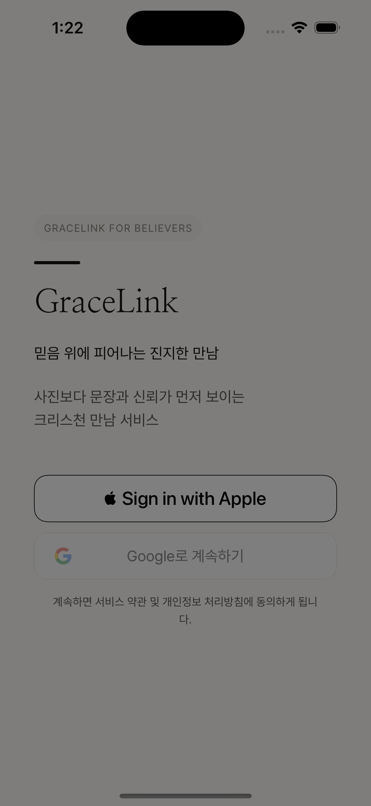
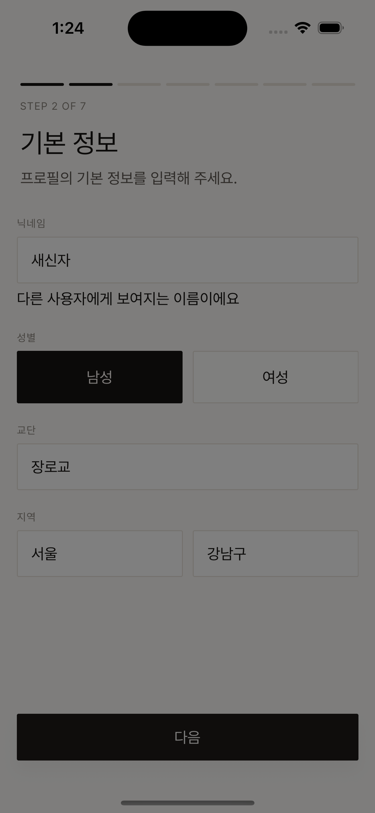
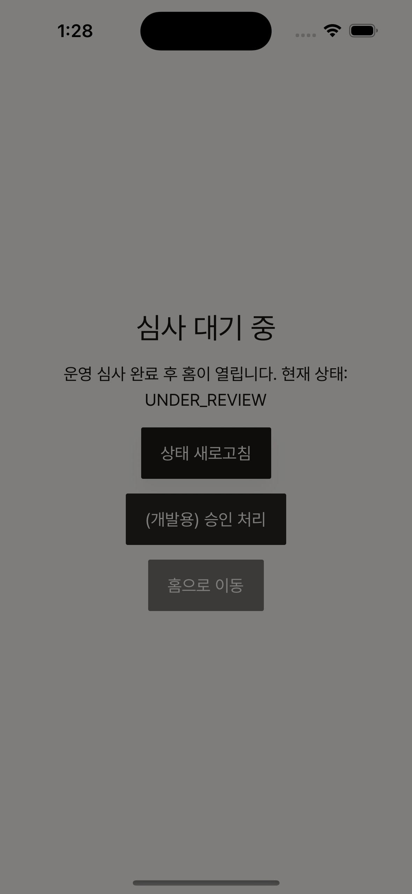
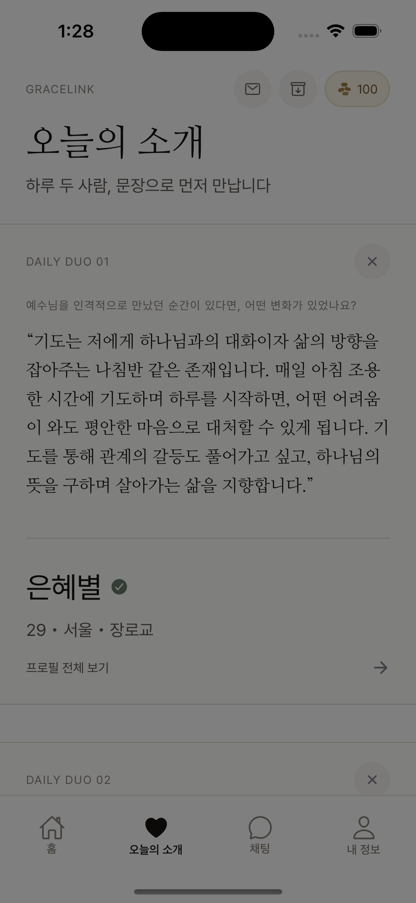
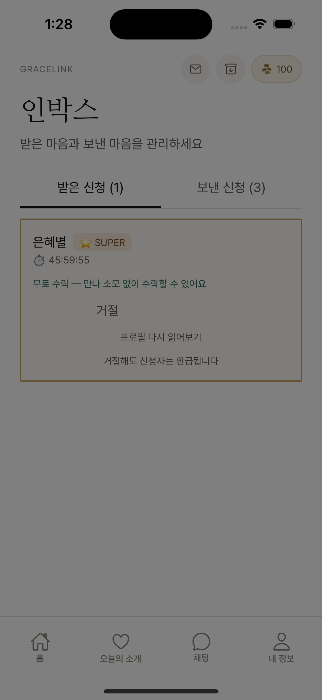
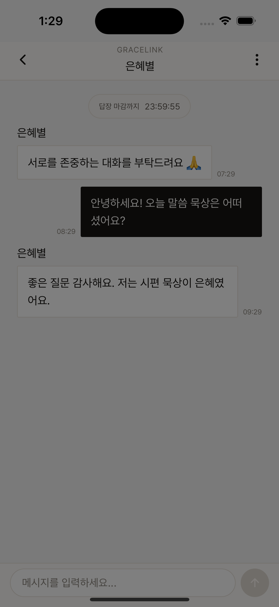
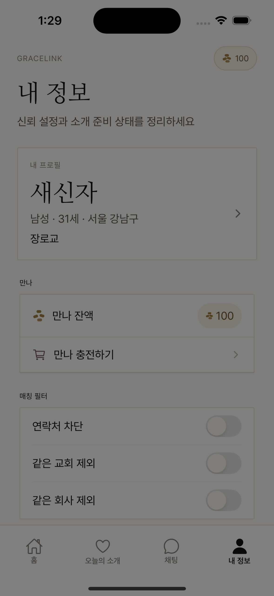
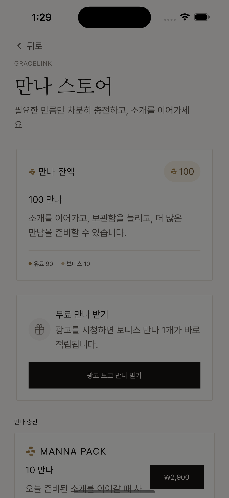
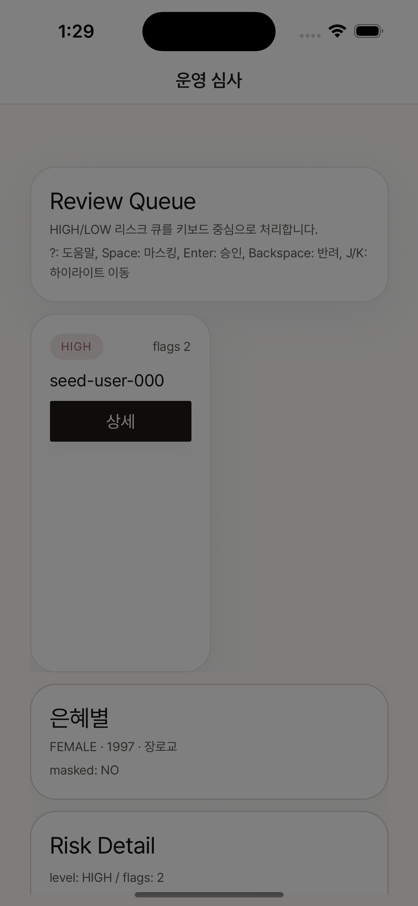

> Source: `grace-link-RN/docs/prd-reverse-engineered-current-app.md`
> Migrated into `grace-link-pm` on 2026-04-01.
> Status: mobile/source reference.

# GraceLink 현재 제품 PRD (SSOT 기준)

> SSOT 진입 문서: `docs/SSOT.md`

> 기준선: 2026-04-01 현재 RN 앱 구현 + 런타임 캡처 + mock 정책

## 1. 문서 목적

이 문서는 GraceLink의 **현재 제품 상태**를 정의하는 기준 PRD다.

이 문서를 쓰는 목적은 단순히 “현재 앱을 설명”하는 데 있지 않다. 더 중요한 목적은 앞으로 제품을 고도화할 때, 팀이 아래 질문에 같은 답을 하게 만드는 것이다.

- 지금 앱은 실제로 무엇을 제공하고 있는가?
- 무엇이 이미 구현되었고, 무엇이 아직 목표 상태에 머물러 있는가?
- 어떤 정책은 절대 쉽게 건드리면 안 되는가?
- 다음 우선순위는 무엇이어야 하는가?

### 이 문서를 먼저 읽어야 하는 사람
- 제품 기획자
- 디자이너
- 모바일 개발자
- 백엔드/API 담당자
- 운영/심사 담당자

### 이 문서의 성격
- **현재 상태 기준 문서**다.
- 목표 상태를 상상해서 적지 않는다.
- 과거 v7.3 명세와 다른 부분이 있으면, 현재 앱을 기준선으로 놓고 차이를 별도 표기한다.

## 2. 핵심 증거 화면

핵심 화면은 RN 런타임에서 직접 캡처했다. 전체 갤러리는 `docs/runtime-captures/ios/README.md`를 참고한다.

### 2.1 승인 전 경험

<table>
  <tr>
    <td align="center"><strong>로그인</strong></td>
    <td align="center"><strong>온보딩 기본 정보</strong></td>
    <td align="center"><strong>심사 대기</strong></td>
  </tr>
  <tr>
    <td></td>
    <td></td>
    <td></td>
  </tr>
</table>

### 2.2 승인 후 핵심 루프

<table>
  <tr>
    <td align="center"><strong>오늘의 소개</strong></td>
    <td align="center"><strong>인박스</strong></td>
    <td align="center"><strong>채팅 상세</strong></td>
  </tr>
  <tr>
    <td></td>
    <td></td>
    <td></td>
  </tr>
</table>

### 2.3 보조 경험 / 운영

<table>
  <tr>
    <td align="center"><strong>내 정보</strong></td>
    <td align="center"><strong>스토어</strong></td>
    <td align="center"><strong>운영 심사</strong></td>
  </tr>
  <tr>
    <td></td>
    <td></td>
    <td></td>
  </tr>
</table>

## 3. 현재 제품 한 줄 정의

GraceLink는 **사진이 아니라 신앙과 문장으로 사람을 소개하고, 운영 승인과 제한된 행동 비용으로 만남의 의도를 높이는 소개 앱**이다.

핵심은 세 가지다.
- 사진이 아니라 텍스트/신앙 정보를 먼저 본다.
- 승인 전에는 핵심 경험을 열지 않는다.
- 추천, 신청, 재진입에 비용을 붙여 행동의 가벼움을 줄인다.

## 4. 현재 릴리스 범위

### 4.1 포함 범위

#### 승인 전
- splash
- Google/Apple SSO 로그인
- PASS 인증 단계
- 기본 정보 입력
- 교회 등록/등록 요청
- 태그 선택
- 좋아하는 말씀/찬양 입력
- L1 신앙 질문 선택/답변
- 제출 전 확인
- 심사 대기

#### 승인 후
- 홈
- 오늘의 소개
- 인박스
- 채팅 목록/상세
- 내 정보
- 보관함
- 스토어
- 상대 프로필 상세
- 내 정보 수정
- 운영 심사 콘솔

### 4.2 현재 릴리스에서 빠진 것
- 사진 관련 기능 전부
- 약관 전용 화면
- OB-04 직장 인증 화면
- L2 실제 작성/제출 플로우
- Deep Read 잠금 해제 BM

## 5. 대상 사용자

### 5.1 핵심 사용자
- 기독교 싱글
- 외형보다 신앙, 가치관, 말투를 먼저 보고 싶은 사용자
- 무한 스와이프보다 의도 있는 만남을 원하는 사용자

### 5.2 운영 사용자
- 승인/반려/정지/마스킹 결정을 빠르게 내려야 하는 운영자
- 신고/리스크 패턴을 보고 우선순위 큐를 처리해야 하는 관리자

## 6. 제품 원칙

현재 구현 기준으로, 아래 원칙은 제품의 뼈대 역할을 한다.

### 6.1 No Photo
- 프로필 사진 업로드 없음
- 채팅 이미지 전송 없음
- 시각 정보보다 문답/말씀/태그 중심 구조 유지

### 6.2 Approval Gate
- 승인 전에는 메인 추천 경험을 열지 않는다.
- 승인 대기 화면이 실제 플로우 안에 들어 있다.

### 6.3 High Intent
- 추천은 제한적이다.
- 추가 추천, 매칭 신청, 보관함 유지에 비용 구조가 붙어 있다.
- 무한 탐색보다 “선택의 무게”를 높이는 쪽이다.

### 6.4 Manual Trust Layer
- 운영 심사 콘솔이 실제 제품 구조 안에 존재한다.
- 신고/리스크/마스킹/정지 흐름이 별도 운영 레이어를 형성한다.

## 7. 현재 사용자 경험

### 7.1 승인 전 경험

#### 로그인 진입
- splash 이후 login으로 이동한다.
- 로그인은 Apple/Google SSO만 제공한다.
- 브랜드 톤은 비교적 차분하고, 상단 카피 + 2개 SSO 버튼 중심이다.

#### 온보딩
현재 실사용 온보딩은 **7단계**다.

| 단계 | 화면 | 현재 역할 |
| --- | --- | --- |
| STEP 1 | PASS 인증 | 본인인증 시작점 |
| STEP 2 | 기본 정보 | 닉네임/성별/교단/지역 |
| STEP 3 | 교회 등록 | 검색 또는 등록 요청 |
| STEP 4 | 태그 | 5~15개 선택 |
| STEP 5 | 말씀/찬양 | 말씀 필수 1개 |
| STEP 6 | 신앙 질문 | 3개 선택 + 각 150자 이상 |
| STEP 7 | 제출 전 확인 | 수정/검토/제출 |

#### 심사 대기
- 제출 후 `UNDER_REVIEW`
- 승인 전 홈 진입 불가
- 현재 mock 환경에서는 개발용 승인 버튼 존재

### 7.2 승인 후 메인 경험

#### 홈
- 현재 홈은 “말씀/공지 허브” 역할이다.
- 추천은 홈이 아니라 별도 탭으로 분리되어 있다.

#### 오늘의 소개
- 추천 카드를 소비하는 핵심 화면이다.
- `DAILY DUO` 포맷으로 2명 기본 노출
- pass 가능
- 추가 2명 보기 CTA 존재
- 추가 추천은 paywall과 자연스럽게 연결된다.

#### 인박스
- 받은 신청 / 보낸 신청 탭 구조
- 받은 신청에서는 응답 countdown과 `SUPER` 강조가 보인다.
- 보낸 신청에서는 상태/환불 여부가 중심이다.

#### 채팅
- 목록과 상세가 분리되어 있다.
- 목록은 최근 메시지와 잔여시간 감각을 보여준다.
- 상세는 메시지 흐름 + 타이머 + 입력 영역이 공존한다.

#### 내 정보
- 내 프로필 카드
- 만나 잔액/스토어 진입
- 매칭 필터
- 보관함/운영 심사/로그아웃

## 8. 수치 정책 요약

### 8.1 온보딩 검증
| 항목 | 현재 규칙 |
| --- | --- |
| 닉네임 | 2~10자 |
| 출생연도 | 4자리, 만 19세 이상 |
| 태그 수 | 5~15개 |
| 말씀 | 최소 1개 |
| L1 질문 | 정확히 3개 |
| L1 답변 | 각 150자 이상 |

### 8.2 추천 / 보관함
| 항목 | 현재 규칙 |
| --- | --- |
| 추가 추천 | 만나 1로 +2명 |
| LOCK 전환 | 생성 후 48시간 |
| 삭제 | 생성 후 7일 |
| 잠금 해제 | 만나 1 |
| 보관 연장 | 만나 1 / 3일 / 최대 2회 |
| 삭제 카드 복구 | 만나 2 / 주 2회 |

### 8.3 매칭
| 항목 | 현재 규칙 |
| --- | --- |
| NORMAL 신청 | 만나 3 |
| SUPER 신청 | 만나 6 |
| NORMAL 수락 | 만나 3 |
| SUPER 수락 | 무료 |
| 인박스 응답 마감 | 48시간 |

### 8.4 채팅
| 항목 | 현재 규칙 |
| --- | --- |
| 첫 메시지 마감 | 24시간 |
| 답장 마감 | 24시간 |
| 의미 있는 메시지 | 5자 이상 + 한글/영문 포함 + 순수 웃음/울음 반복 제외 |

### 8.5 광고 보상
| 항목 | 현재 규칙 |
| --- | --- |
| 광고 1회 보상 | 만나 +1 |
| 일일 상한 | 3회 |
| 쿨다운 | 10분 |
| placement | paywall / my_free_manna / empty_state |

## 9. 운영 관점 해석

### 9.1 좋은 점
- 운영 심사 콘솔이 이미 존재한다.
- 위험 큐, action log, masking flow가 화면 단위로 살아 있다.
- 사용자용 신고/차단 구조와 운영 큐가 제품 철학과 맞닿아 있다.

### 9.2 현재 운영 리스크
- mock 중심이라 실운영 권한 모델은 아직 약하다.
- 채팅 신고/차단은 일부 toast 중심이라 실연동 강도가 낮다.
- 광고/결제/본인인증 검증은 실제 서비스 수준으로 완결되어 있지 않다.

## 10. 현재 제품의 가장 큰 갭

### 10.1 구조 갭
- 인박스/보관함/스토어가 핵심 기능인데 하단 탭에서 숨겨져 있다.

### 10.2 온보딩 갭
- 약관 화면 부재
- 직장 인증(OB-04) 부재

### 10.3 BM/차별화 갭
- Deep Read 미구현
- L2 미션 플로우 미구현
- 프로필 상세가 이미 너무 많이 열려 있어 상위 명세의 “텍스트 잠금 BM”이 살아 있지 않다.

### 10.4 카피/정합성 갭
- 광고 보상 실지급은 +1인데, 일부 UX 문구는 +2 뉘앙스가 남아 있다.

## 11. 제품 리스크

| 리스크 | 설명 |
| --- | --- |
| 발견성 저하 | 숨김 핵심 라우트 때문에 사용자 학습 비용이 높다 |
| 가치 제안 약화 | Deep Read/L2/직장 인증이 빠져 제품의 차별화가 약해진다 |
| 정책 불일치 | mock 정책, 화면 카피, 상위 명세가 일부 어긋난다 |
| 운영-사용자 괴리 | 운영 콘솔은 비교적 완성됐지만 사용자 안전 UX는 일부 약하다 |

## 12. 다음 우선순위 제안

### P1. IA 재정리
- 인박스/보관함/스토어의 발견성 개선
- `/shop` vs `/(tabs)/shop` 중복 정리

### P2. 온보딩 완성도 보강
- 약관 UI 추가
- OB-04 직장 인증 방향 결정
- 교회/회사 인증과 필터 연결 재점검

### P3. 차별화 기능 복구
- L2 작성/보상 플로우 연결
- Deep Read 정책 적용
- 프로필 상세 공개 레벨 재설계

### P4. 안전/운영 연결 강화
- 사용자 신고/차단 UX와 운영 큐 정합화
- 운영 액션의 실제 권한 모델 정리

### P5. 정책/카피 정합화
- 광고 보상 수치/문구 통일
- 현재 앱 기준 용어 정리

## 13. 변경 시 가드레일

아래를 건드릴 때는 반드시 문서와 캡처를 함께 갱신한다.

- 라우트/탭 구조
- 온보딩 스텝 수
- 만나 cost
- 광고 보상 수치
- 매칭 응답 시간
- 채팅 종료 시간
- 운영 심사 정책

## 14. 결론

현재 GraceLink는 “사진 없는 신앙 소개 앱”의 핵심 루프를 이미 구현했다.

다만 제품 고도화의 핵심은 새 기능을 무작정 덧붙이는 데 있지 않다. 진짜 중요한 일은 다음 세 가지다.
- 숨겨진 핵심 경험을 더 잘 드러내고,
- 빠진 차별화 기능을 복구하고,
- 화면/정책/문서의 기준선을 하나로 맞추는 것.

앞으로의 제품 변경은 이 문서를 현재 상태 기준선으로 두고, `docs/SSOT.md`와 함께 사용한다.
