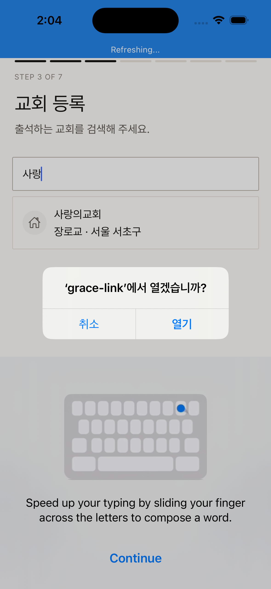
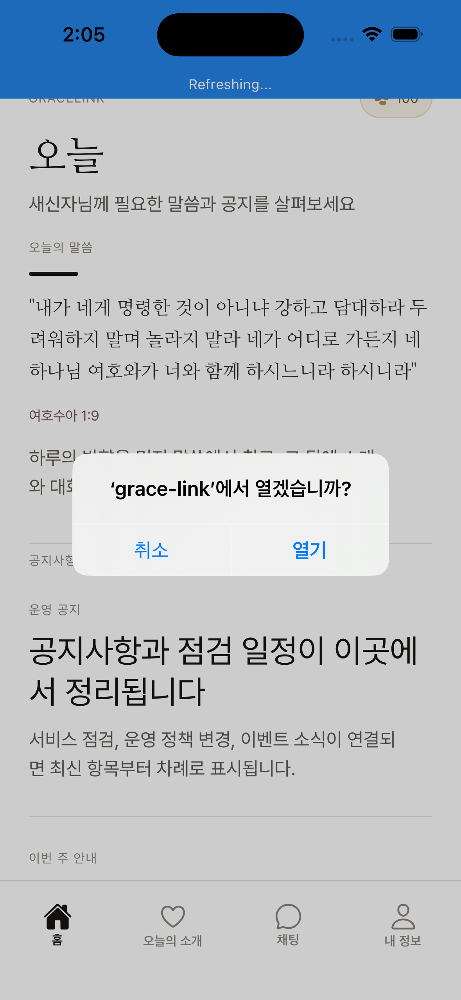
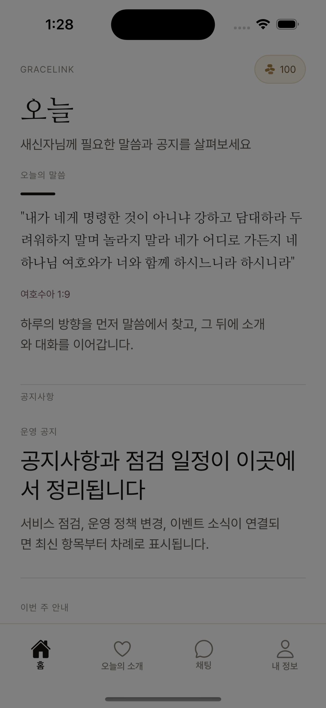
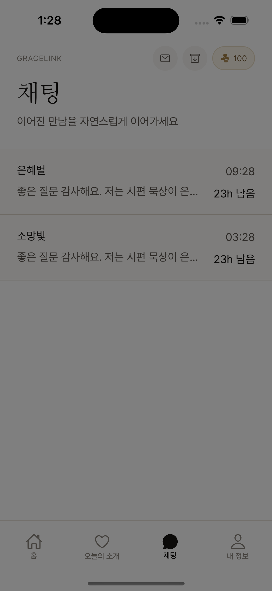
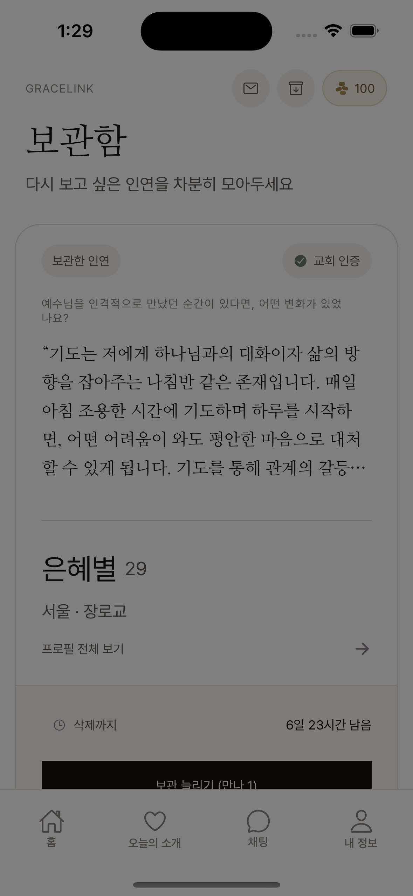
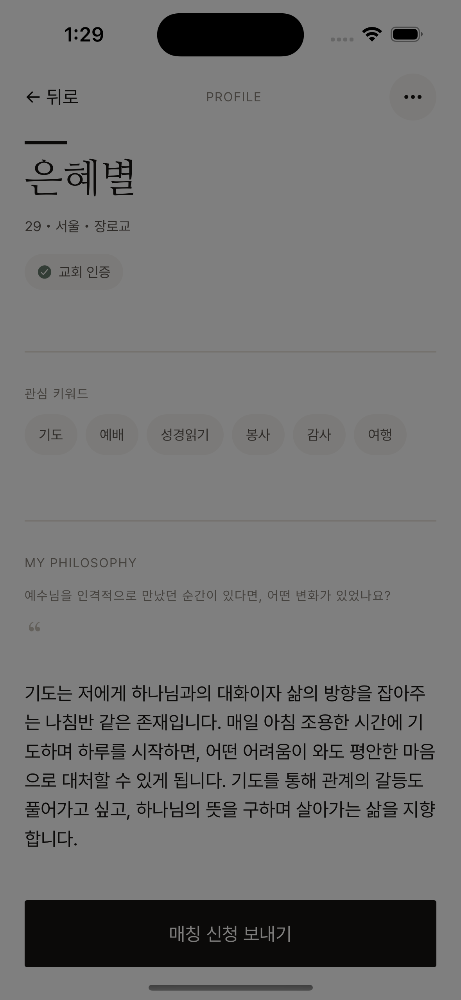
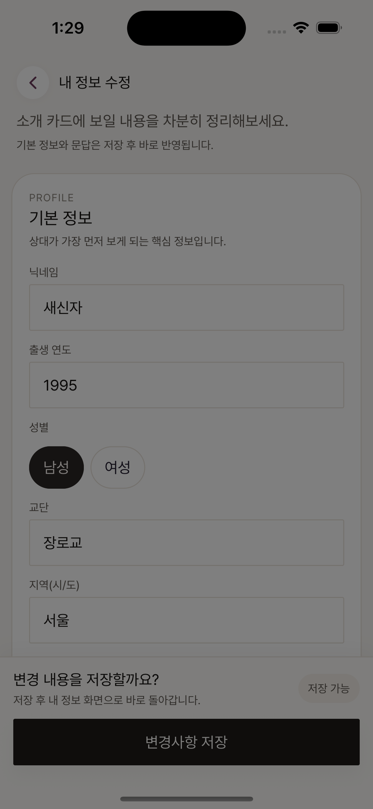

> Source: `grace-link-RN/docs/runtime-captures/ios/README.md`
> Migrated into `grace-link-pm` on 2026-04-01.
> Status: mobile/source reference.

# GraceLink RN 런타임 캡처

> SSOT 진입 문서: `docs/SSOT.md`

- 캡처 일시: 2026-04-01
- 실행 환경: iPhone 16 Simulator / iOS 18.6
- 실행 방식: Expo Go + Expo Router + mock API
- 목적: 코드 기반 문서화를 실제 RN 런타임 화면 캡처로 보강

## 캡처 세트

| 화면 | 파일 | 런타임 확인 포인트 |
| --- | --- | --- |
| 로그인 | `login-screen.png` | `GraceLink`, `GRACELINK FOR BELIEVERS`, Apple/Google 로그인 버튼 |
| 온보딩 PASS | `onboarding-pass-devbuild.png` | STEP 1 인증 단계 진입 확인 |
| 온보딩 기본정보 | `onboarding-basic-screen.png` | `STEP 2 OF 7` 표기 확인 |
| 온보딩 교회 등록 | `onboarding-church-devbuild.png` | STEP 3 교회 등록 단계 진입 확인 |
| 온보딩 태그 | `onboarding-tags-devbuild.png` | STEP 4 태그 선택 단계 진입 확인 |
| 온보딩 말씀/찬양 | `onboarding-verses-devbuild.png` | STEP 5 입력 단계 진입 확인 |
| 온보딩 신앙 질문 | `onboarding-qa-devbuild.png` | STEP 6 질문 단계 진입 확인 |
| 온보딩 제출 전 확인 | `onboarding-preview-devbuild.png` | STEP 7 제출 직전 화면 진입 확인 |
| 심사 대기 | `under-review.png` | `UNDER_REVIEW` 상태 화면 확인 |
| 홈 | `home.png` | 홈 진입 후 상단 메인 레이아웃 확인 |
| 오늘의 소개 | `reco.png` | `DAILY DUO 01`, `DAILY DUO 02` 카드 확인 |
| 인박스 | `inbox.png` | 받은 신청 카드, `SUPER`, 카운트다운 노출 확인 |
| 채팅 목록 | `chat-list.png` | 채팅방 목록, 최근 메시지/타이머 영역 확인 |
| 내 정보 | `settings.png` | 내 정보 대시보드, 만나/필터/메뉴 블록 확인 |
| 보관함 | `vault.png` | 카드형 보관 UI와 CTA 영역 확인 |
| 스토어 | `shop.png` | `MANNA PACK`, 가격/잔액 블록 확인 |
| 상대 프로필 | `profile.png` | `PROFILE`, `MY PHILOSOPHY` 섹션 확인 |
| 내 정보 수정 | `profile-edit.png` | 프로필 편집 폼 레이아웃 확인 |
| 채팅 상세 | `chat-detail.png` | 대화 목록 + 타이머/입력 영역 확인 |
| 운영 심사 | `admin.png` | `Review Queue`, `HIGH`, risk detail 확인 |

## 런타임 갤러리

### 1. 로그인

- 브랜드 카피와 SSO 진입 버튼이 첫 화면에서 바로 보인다.
- Apple / Google 중심 로그인 구조가 실제 런타임에서도 유지된다.

### 2. 온보딩 기본 정보

- `STEP 2 OF 7` 스텝 UI가 실제로 보인다.
- 기본 정보 입력 플로우가 현재 온보딩 중심 UX임을 보여준다.

### 2.1 추가 온보딩 단계 (dev build)

<table>
  <tr>
    <td align="center"><strong>STEP 1 PASS</strong></td>
    <td align="center"><strong>STEP 3 교회 등록</strong></td>
    <td align="center"><strong>STEP 4 태그</strong></td>
  </tr>
  <tr>
    <td></td>
    <td></td>
    <td></td>
  </tr>
  <tr>
    <td align="center"><strong>STEP 5 말씀/찬양</strong></td>
    <td align="center"><strong>STEP 6 신앙 질문</strong></td>
    <td align="center"><strong>STEP 7 제출 전 확인</strong></td>
  </tr>
  <tr>
    <td></td>
    <td></td>
    <td></td>
  </tr>
</table>

- 이 추가 캡처 세트는 **Expo Go가 아니라 dev build**로 확보했다.
- 몇 장은 한국어 OCR이 약하고 `Refreshing...` 오버레이가 일부 보이지만, 각 스텝 자체가 실제 네이티브 런타임에서 열리는 것은 확인했다.

### 3. 심사 대기

- 상태 중심 화면으로 구성되어 있고, 승인 전 메인 진입을 막는 경험이 분명하다.

### 4. 홈

- OCR은 제한적이지만 홈 전용 레이아웃과 상단 헤더 구조를 확인했다.

### 5. 오늘의 소개

- `DAILY DUO 01`, `DAILY DUO 02`가 실제로 노출된다.
- 카드 중심 탐색 화면이라는 점이 가장 잘 드러나는 캡처다.

### 6. 인박스

- 받은 신청 카드, `SUPER` 강조, countdown 요소가 실제로 존재한다.

### 7. 채팅 목록

- 최근 메시지/시간/잔여시간 같은 리스트 정보가 복합적으로 쌓인다.

### 8. 내 정보

- 내 프로필 카드 아래에 만나/필터/기타 메뉴가 아래로 내려가는 구조다.

### 9. 보관함

- 카드형 레이아웃과 CTA 구조가 현재 보관 UX의 중심이다.

### 10. 스토어

- `MANNA PACK`, 가격, 잔액 표시가 한 화면에서 함께 보인다.

### 11. 상대 프로필

- `PROFILE`, `MY PHILOSOPHY` 텍스트가 실제로 보이고, 소개 중심 설계가 살아 있다.

### 12. 내 정보 수정

- 저장 전 입력 폼 중심 편집 화면임을 확인했다.

### 13. 채팅 상세

- 채팅 상세는 메시지 목록 + 상단 타이머/시간 정보가 함께 들어간다.

### 14. 운영 심사

- `Review Queue`, `HIGH`, `Risk Detail`, `flags 2` 등이 실제로 노출된다.
- 사용자 화면보다 운영 콘솔의 정보 밀도가 높다는 점을 확인할 수 있다.

## 메모

- 이번 캡처는 **웹이 아니라 RN 시뮬레이터**에서 직접 수행했다.
- 캡처 안정성을 위해 Expo Go를 iOS 시뮬레이터에 설치한 뒤, Expo Router 경로로 진입했다.
- 로그인/기본 정보/심사 대기/핵심 승인 후 화면군은 직접 확인했다.
- 심화 온보딩 단계는 이후 **dev build**로 다시 캡처해 보강했다.
- dev build 추가 캡처 일부는 화면 전환 직후 `Refreshing...` 상태가 겹쳐 OCR 품질이 낮지만, 실제 단계 진입 증거로는 충분하다.

## 파일 목록

- `login-screen.png`
- `onboarding-pass-devbuild.png`
- `onboarding-basic-screen.png`
- `onboarding-church-devbuild.png`
- `onboarding-tags-devbuild.png`
- `onboarding-verses-devbuild.png`
- `onboarding-qa-devbuild.png`
- `onboarding-preview-devbuild.png`
- `under-review.png`
- `home.png`
- `reco.png`
- `inbox.png`
- `chat-list.png`
- `settings.png`
- `vault.png`
- `shop.png`
- `profile.png`
- `profile-edit.png`
- `chat-detail.png`
- `admin.png`
